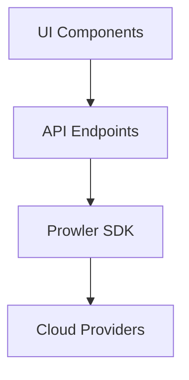
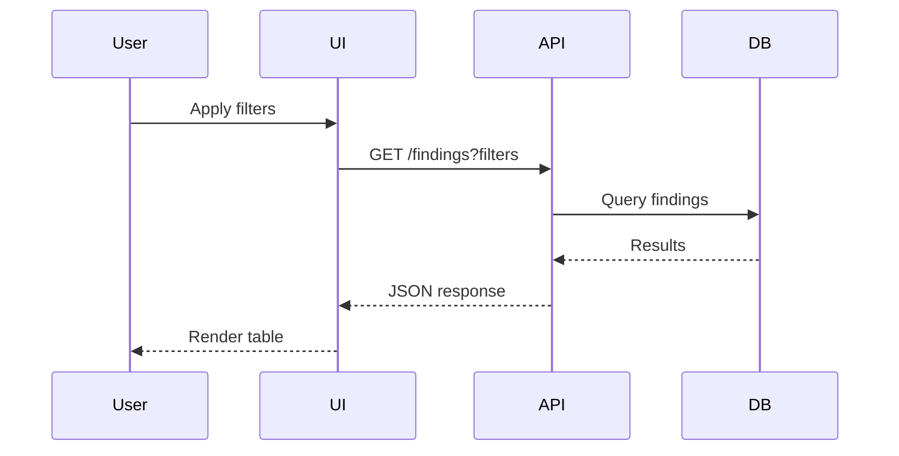
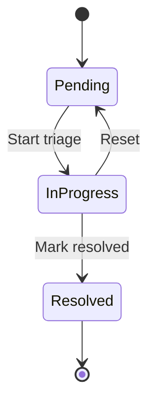
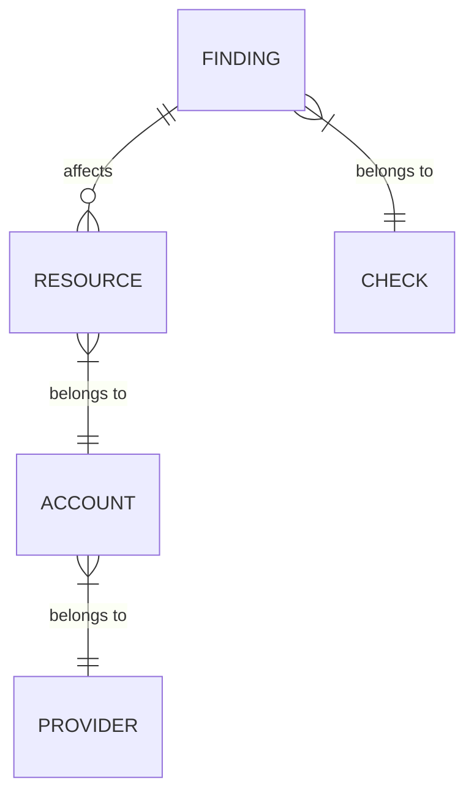

## When to Use

Use this skill when creating Jira epics for:
- Large features spanning multiple components
- New views/pages in the application
- Major refactoring initiatives
- Features requiring API + UI + SDK work

## Epic Template

```markdown
# {Epic Title}

**Figma:** {figma link if available}

## Feature Overview

{2-3 paragraph description of what this feature does and why it's needed}

## Requirements

### {Section 1: Major Functionality Area}

#### {Subsection}
- Requirement 1
- Requirement 2
- Requirement 3

#### {Another Subsection}
- Requirement 1
- Requirement 2

### {Section 2: Another Major Area}

#### {Subsection}
- Requirement 1
- Requirement 2

## Technical Considerations

### Performance
- {Performance requirement 1}
- {Performance requirement 2}

### Data Integration
- {Data source}
- {Integration points}

### UI Components
- {Component 1}
- {Component 2}

## Implementation Checklist

- [ ] {Major deliverable 1}
- [ ] {Major deliverable 2}
- [ ] {Major deliverable 3}

## Diagrams

{Mermaid diagrams for architecture, flow, data model, etc.}
```

## Epic Title Conventions

Format: `[EPIC] Feature Name`

**Examples:**
- `[EPIC] Findings View`
- `[EPIC] Multi-tenant Support`
- `[EPIC] Compliance Dashboard Redesign`
- `[EPIC] GovCloud Support`

## Required Sections

### 1. Feature Overview
Brief but complete description of:
- What the feature does
- Who uses it
- Why it's needed

### 2. Requirements
Organized by functional area:
- Group related requirements together
- Use clear headers and subheaders
- Be specific and testable

### 3. Technical Considerations
Always include:
- **Performance**: Large dataset handling, pagination, caching
- **Data Integration**: Data sources, APIs, relationships
- **UI Components**: Reusable components, design system usage

### 4. Implementation Checklist
High-level deliverables that will become individual tasks:
- Each checkbox = potential Jira task
- Order by dependency (API before UI)
- Include testing milestones

## Diagrams

Use Mermaid for:

### Architecture Diagrams


### Data Flow Diagrams


### State Diagrams


### Entity Relationship Diagrams


## Splitting Epic into Tasks

After creating the epic, generate individual tasks using the `jira-task` skill:

### Task Naming Pattern
From epic `[EPIC] Findings View`, create:
- `[FEATURE] Findings table with pagination (UI)`
- `[FEATURE] Findings filters - provider and account (UI)`
- `[FEATURE] Findings detail panel - Overview tab (UI)`
- `[FEATURE] Findings detail panel - Resources tab (UI)`
- `[FEATURE] Findings bulk actions - mute/suppress (API + UI)`
- `[FEATURE] Findings search functionality (API + UI)`

### Task Dependencies
Always specify in each task:
```markdown
## Related Tasks
- Epic: [EPIC] Findings View
- Blocked by: [task if any]
- Blocks: [task if any]
```

## Figma Integration

When Figma links are provided:
- Include main Figma link at top
- Reference specific frames in relevant sections
- Example: `https://www.figma.com/design/xxx?node-id=1830-44712&m=dev`

## Output Format

```markdown
## Epic: [EPIC] {Title}

{Full epic content following template}

---

## Suggested Tasks

Based on this epic, create the following tasks:

| # | Title | Component | Blocked By |
|---|-------|-----------|------------|
| 1 | [FEATURE] Task name | API | - |
| 2 | [FEATURE] Task name | UI | Task 1 |
| 3 | [FEATURE] Task name | UI | Task 2 |

Would you like me to generate the full task descriptions?
```

## Checklist Before Submitting

1. ✅ Title follows `[EPIC] Feature Name` format
2. ✅ Feature Overview explains what/who/why
3. ✅ Requirements are organized by functional area
4. ✅ Technical Considerations cover performance, data, UI
5. ✅ Implementation Checklist has high-level deliverables
6. ✅ Diagrams included where helpful (Mermaid format)
7. ✅ Figma links included if available
8. ✅ Suggested tasks table provided at the end

## Formatting Rules

**CRITICAL:** All output MUST be in Markdown format, ready to paste into Jira.

- Use `#` for epic title, `##` for main sections, `###` for subsections
- Use `**bold**` for emphasis
- Use `- [ ]` for checkboxes in Implementation Checklist
- Use ``` for code blocks and Mermaid diagrams
- Use `backticks` for file paths, commands, and code references
- Use tables for Suggested Tasks section
- Use `---` to separate epic from suggested tasks

## Jira MCP Integration

**CRITICAL:** When creating epics via MCP, use these exact parameters:

### Required Fields

```json
{
  "project_key": "PROWLER",
  "summary": "[EPIC] Feature name",
  "issue_type": "Epic",
  "additional_fields": {
    "customfield_10359": {"value": "UI"}
  }
}
```

### Team Field (REQUIRED)

The `customfield_10359` (Team) field is **REQUIRED**. Options:
- `"UI"` - Frontend epics
- `"API"` - Backend epics
- `"SDK"` - Prowler SDK epics

### Work Item Description Field

**IMPORTANT:** The project uses `customfield_10363` (Work Item Description) instead of the standard `description` field for display in the UI.

**CRITICAL:** Use **Jira Wiki markup**, NOT Markdown:
- `h2.` instead of `##`
- `*text*` for bold instead of `**text**`
- `* item` for bullets (same)
- `** subitem` for nested bullets

After creating the epic, update the description with:

```json
{
  "customfield_10363": "h2. Feature Overview\n\n{overview}\n\nh2. Requirements\n\n*{Section 1}*\n* {requirement 1}\n* {requirement 2}\n\n*{Section 2}*\n* {requirement 1}\n* {requirement 2}\n\nh2. Technical Considerations\n\n*Performance:*\n* {consideration 1}\n\n*Data Integration:*\n* {consideration 2}\n\nh2. Implementation Checklist\n\n* [ ] {deliverable 1}\n* [ ] {deliverable 2}\n* [ ] {deliverable 3}"
}
```

### Linking Tasks to Epic

When creating child tasks, use the epic key as parent:

```json
{
  "additional_fields": {
    "parent": "PROWLER-XXX"
  }
}
```

### Workflow Transitions

```
Backlog (10037) → To Do (14) → In Progress (11) → Done (21)
                → Blocked (10)
```

### MCP Commands Sequence

1. **Create epic:**
```
mcp__mcp-atlassian__jira_create_issue (issue_type: "Epic")
```

2. **Update Work Item Description:**
```
mcp__mcp-atlassian__jira_update_issue with customfield_10363
```

3. **Create child tasks:**
```
mcp__mcp-atlassian__jira_create_issue with parent: EPIC-KEY
```

4. **Assign and transition:**
```
mcp__mcp-atlassian__jira_update_issue (assignee)
mcp__mcp-atlassian__jira_transition_issue (status)
```

## Keywords
jira, epic, feature, initiative, prowler, large feature
